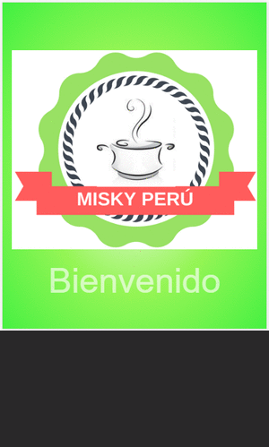

# **Producto final: Misky Perú**

## **Desarollo  del proyecto**

Se realizó una lluvia de ideas para ver que tema  se podría realizar, Una  vez definido  se empezó a indagar y buscar todo la información referente para identificar que el tema era  viable.

Para crear la red social se realizó entrevistas face to face y encuestas  por internet para conocer a nuestro usuario y así ofrecerle una mejor experiencia.

   * Encuesta y resultados: https://goo.gl/forms/pcg4uVzgS45q0TvL2

## **Prototipos iniciales**

## **Descripción del producto a realizar**

Hoy en día encontrar restaurantes confiables donde se pueda comer rico no es tan fácil, a veces  se va a uno por alguna recomendación, por algún plato de comida especial o simplemente para probar. Muchas veces salimos satisfechos, pero también ha pasado que la comida no fue rica y nos llevamos la mala experiencia de haber estado ahí.  Este mal rato se evitaría teniendo a la mano una red social con la cual, con un simple click, tendrías toda la información de diversos restaurantes.

## **Objetivo**

Esta red social fue creada para que los usuarios obtengan información confiable de nuestra parte o de otros usuarios, garántizandoles una buena experiencia y haciéndolos sentir seguros con la decisión tomada. Asimismo, posee versión móvil y desktop para que sea accesible desde cualquier parte donde se esté.

  

## **Conocimientos Técnicos**

* Grid System

* Media Queries y Viewport

* Responsive Web Design

* Frameworks(Bootstrap)

* Jquery

* Firebase

* Git

* Github

* Websocket

## **Flujo de la aplicación**

* Ingresa  a la vista splash con un tiempo de duración de aproximadamente 5 segundos.

* Aparece la vista login, donde el usuario puede conectarse con Gmail para entrar al website.

* Al ingresar, aparece la vista principal(main-view), donde el usuario puede postear, confirmar solicitudes de amistad, etc.

* En la barrade navegación, hay diversas opciones. Destacan el menú de notificaciones y el menú desplegable. Este ultimo permite ingresar a la vista chat o salir de la red social.

* También puede ir a la vista donde se le mostrarán sus seguidores(vista seguir), escogiendo la opción Amigos/Seguidores del panel izquierdo.

* Por último, se puede acceder al perfil del usuario al ingresar a la vista perfil(ver brarra de navegación), dondé se puede observar las publicaciones que hizo el usuario.

## **Integrantes**

* Paola Flores
* Araceli Gutarra
